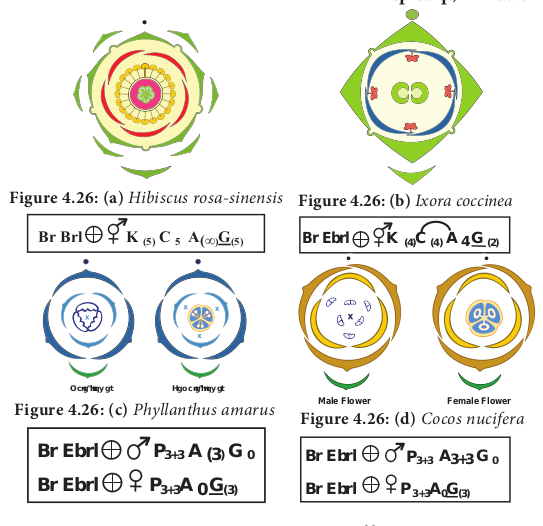

# Construction of floral diagram and floral formula

A floral formula is a simple way to explain the salient features of a flower. The floral diagram is a representation of the cross section of the flower. It represents floral whorls arranged as viewed from above. Floral diagram shows the number and arrangement of bract, bracteoles and floral parts, fusion, overlapping and placentation.

The branch that bears the flower is called **mother axis**.

The side of the flower facing the mother axis is called **posterior side**. The side facing the bract is the anterior side.

The members of different floral whorls are shown arranged in concentric rings.

Br : Bracteate.
Ebr : Ebracteate
Brl : Bracteolate
Ebrl : Ebracteolate

- : Actinomorphic
  % : Zygomorphic
  : Staminate
  : Pistillate
  : Bisexual flower

**s:** d for sepals, ens attached f the ovary Example: ceae.
**K :** Calyx, **K** five sepals, aposepalous, **K(,)** five sepals synsepalous.

**C** : Corolla, C5 five petals, **apopetalous**, C(5) five petals **sympetalous C(**2+3) corolla bilabiate with upper lib two lobes.

**A :** Androecium **A**3 three stamens free, A2+2, Stamens 4, two whorls (**didynamous**) each whorl two stamens (free)

A(9)+1 – stamens ten, two bundles **(diadelphous)** 9 stamens unite to form one bundle,1 stamen form another bundle.

**C**5**A**5—**Epipetalous** represented by an arc. A0 :**Staminode**(sterile stamen) G. Gynoecium or pistil – **G2** – Carpels two,

free **(apocarpous)** G(3) – Carpels three, united **(syncarpous)** G0 – pistillode (sterile carpel)

**Figure 4.26: (a)** _Hibiscus rosa-sinensis_

**Br Brl K (5) C 5 A(∞)G(5)**

**Br Ebrl**

**Male Flower**

•

**Br Ebrl**

**Br Ebrl**

**Ocng"hnqygt Hgocng"hnqygt**

**Figure 4.26: (c)** _Phyllanthus amarus_

**Br Ebrl P3+3 A (3) G 0 Br Ebrl P3+3A 0 G(3)**

G – superior ovary G inferior ovary G**–** – semiinferior ovary ∞ – Indefinite number of units

