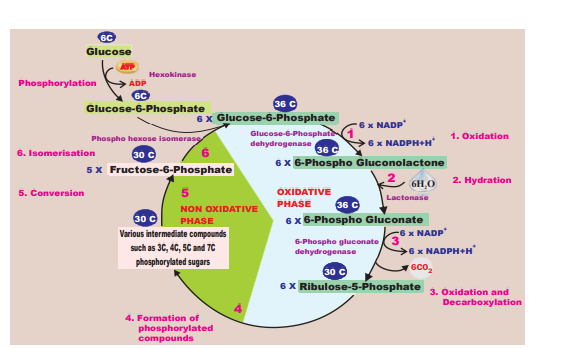

# 14.9 Pentose Phosphate Pathway (Phospho Gluconate Pathway)

During respiration breakdown of glucose in cytosol occurs both by glycolysis (about 2/3) as well as by oxidative pentose phosphate pathway (about 1/3). Pentose phosphate pathway was described by **Warburg**, **Dickens** and **Lipmann**  (1938). Hence, it is also called **Warburg-Dickens-Lipmann** pathway. It takes place in cytoplasm of mature plant cells. It is an alternate way for breakdown of glucose (Figure 14.15).

It is also known as **Hexose monophosphate shunt (HMP Shunt) or Direct Oxidative Pathway**. It consists of two phases, oxidative phase and non-oxidative phase. The oxidative events convert six molecules of six carbon Glucose-6-phosphate to 6 molecules of five carbon sugar Ribulose-5 phosphate with loss of 6CO2 molecules and generation of 12  NADPH 1 H1 (not  NADH). The remaining reactions known as **non-oxidative pathway**, convert Ribulose-5-phosphate molecules to various intermediates such as Ribose-5-phosphate(5C), Xylulose5-phosphate(5C), Glyceraldehyde-3- phosphate(3C), Sedoheptulose-7-Phosphate (7C), and Erythrose-4-phosphate (4C). Finally, five molecules of glucose-6- phosphate is regene-rated (Figure 14.16). The overall reaction is:  

`formulae`
`6 x Glucose-6-Phosphate 1 12NADP1 1 6H2O`

`5 x Glucose-6-Phosphate 1 6CO2 1 Pi 1 12NADPH 112H1`

The net result of complete oxidation of one glucose-6-phosphate yield 6CO2 and 12NADPH 1 H1. The oxidative pentose 

phosphate pathway is controlled by glucose- 6-phosphate dehydrogenase enzyme which is inhibited by high ratio of NADPH to NADP1.

Significance of pentose phosphate pathway 

1. HMP shunt is associated with the generation of two important products, NADPH and pentose sugars, which play a vital role in anabolic reactions.

2. Coenzyme NADPH generated is used for reductive biosynthesis and counter damaging the effects of oxygen free radicals

3. Ribose-5-phosphate and its derivatives are used in the synthesis of DNA, RNA, ATP, NAD1, FAD and Coenzyme A.

4. Erythrose is used for synthesis of anthocyanin, lignin and other aromatic compounds.

5. It plays a role on fixation of Co2 in photosynthesis through RUBP.
