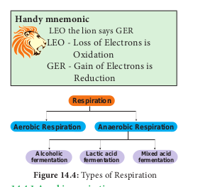

# Types of Respiration
 Respiration is classified into two types as aerobic and anaerobic respiration (Figure 14.4)

`table`

## Aerobic respiration
Respiration occurring in the presence of oxygen is called **aerobic respiration**. During aerobic respiration, food materials like carbohydrates, fats and proteins are completely oxidised into CO2, H2O and energy is released. Aerobic respiration is a very complex process and is completed in four major steps:

1. Glycolysis 
2. Pyruvate oxidation (Link reaction) 
3. Krebs cycle (TCA cycle) 
4. Electron Transport Chain (Terminal oxidation). 

### Anaerobic respiration
 In the absence of molecular oxygen glucose is incompletely degraded into either ethyl alcohol or lactic acid (Table 14.1). It includes two steps:

1. Glycolysis 2. Fermentation
