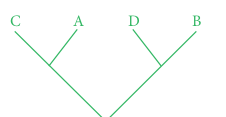
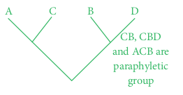
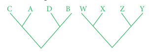

# Cladistics

Analysis of the taxonomic data, and the types of characters that are used in classification have changed from time to time. Plants have been classified based on the morphology before the advancement of microscopes, which help in the inclusions of **sub microscopic** and **microscopic** features. A closer study is necessary while classifying closely related plants. Discovery of new finer molecular analytical techniques coupled with advanced software and computers has ushered in a new era of modern or phylogenetic classification.

The method of classifying organisms into monophyletic group of a common ancestor based on shared apomorphic characters is called **cladistics** (from Greek, _klados_\-branch).

The outcome of a cladistic analysis is a **cladogram**, a tree-shaped diagram that represent the best hypothesis of phylogenetic relationships. Earlier generated cladograms were largely on the basis of morphological characters, but now genetic sequencing data and computational softwares are commonly used in phylogenetic analysis.

**Cladistic analysis**

Cladistics is one of the primary methods of constructing phylogenies, or evolutionary histories. Cladistics uses shared, derived characters to group organisms into clades. These clades have atleast one shared, derived character found in their most recent common ancestor that is not found in other groups hence they are considered more closely related to each other. These shared characters can be morphological such as, leaf, flower, fruit, seed and so on; behavioural, like opening of flowers nocturnal/diurnal; molecular like, DNA or protein sequence and more.

Cladistics accept only **monophyletic groups**. **Paraphyletic** and **polyphyletic** taxa are occasionally considered when such taxa conveniently treated as one group for practical purposes. Example: dicots, sterculiaceae. Polyphyletic groups are rejected by cladistics.

**1. Monophyletic group;** Taxa comprising all the descendants of a common ancestor.

**ii. Paraphyletic group;** Taxon that includes an ancestor but not all of the descendants of that ancestor.

**iii. Polyphyletic group;** Taxa that includes members from two different lineages.

**Need for cladistics**

1. Cladistics is now the most commonly used and accepted method for creating phylogenetic system of classifications.

2. Cladistics produces a hypothesis about the relationship of organisms to predict the phylogeny

3. Cladistics helps to elucidate mechanism of evolution.
