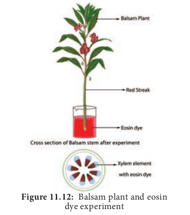
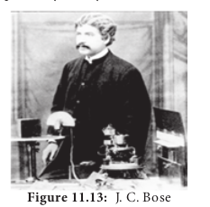
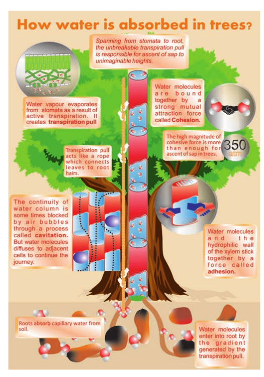

## 11.5 Ascent of Sap

In the last chapter, we studied about water absorption from roots to xylem in a lateral direction and here we will learn about the mechanism of distribution of water inside the plant. Like tributaries join together to form a river, millions of root hairs conduct a small amount of water and confluence in xylem, the superhighway of water conduction. Xylem handles a large amount of water to conduct to many parts in an upward direction.

The water within the xylem along with dissolved minerals from roots is called **sap** and its upward transport is called **ascent of sap**.

### 11.5.1 The Path of Ascent of Sap

There is no doubt; water travels up along the vascular tissue. But vascular tissue has two components namely Xylem and Phloem. Of these two, which is responsible for the ascent of sap? The following experiment will prove that xylem is the only element through which water moves up.

Cut a branch of balsam plant and place it in a beaker containing **eosin** (red colour dye) water. After some time, a red streak appears on the stem indicating the ascent of water. Remove the plant from water and cut a transverse section of the stem and observe it under the microscope. Only xylem element is coloured red, which indicates the path of water is xylem. Phloem is not colored indicating that it has no role in the ascent of sap (Figure 11.12).

**Mechanism of Ascent of Sap**
In ascent of sap, the biggest challenge is the force required to lift the water to the top of the tallest trees. A number of theories have been put forward to explain the mechanism of the ascent of sap. They are, A. Vital force theories, B. Root pressure theory, and C. Physical force theory.

### 11.5.2 Vital Force Theories

According to vital force theories, living cells are mandatory for the ascent of sap. Based on this the following two theories derived:

**1. Relay pump theory of Godlewski (1884)** Periodic changes in osmotic pressure of living cells of the xylem parenchyma and medullary ray act as a pump for the movement of water.
**2. Pulsation theory of J.C.Bose (1923)** Bose invented an instrument called **Crescograph**, which consists of an electric probe connected to a galvanometer (Figure 11.13). When a probe is inserted into the inner cortex of the stem, the galvanometer showed high electrical activity. Bose believed a rhythmic pulsating movement of inner cortex like a pump (similar to the beating of the heart) is responsible for the ascent of sap. He concluded that cells associated with xylem exhibit pumping action and pumps the sap laterally into xylem cells.

**Objections to vital force theories**

**i.Strasburger** (1889) and **Overton** (1911) experimentally proved that living cells are not mandatory for the ascent of sap. For this, he selected an old oak tree trunk which when immersed in **picric acid** and subjected to excessive heat killed all the living cells of the trunk. The trunk when dipped in water, the ascent of sap took place.
**ii.** Pumping action of living cells should be in between two xylem elements (vertically) and not on lateral sides.

### 11.5.3 Root Pressure Theory

If a plant which is watered well is cut a few inches above the ground level, sap exudes out with some force. This is called **sap exudation** or **bleeding**. **Stephen Hales**, father of plant physiology observed this phenomenon and coined the term ‘**Root Pressure’**. **Stoking** (1956) defined root pressure as “_a pressure developing in the tracheary elements of the xylem as a result of metabolic activities of the root_”. But the following objections have been raised against root pressure theory:

i. Root pressure is totally absent in gymnosperms, which includes some of the tallest plants.

ii. There is no relationship between the ascent of sap and root pressure. For example, in summer, the rate of the ascent of sap is more due to transpiration in spite of the fact that root pressure is very low. On the other hand, in winter when the rate of ascent of sap is low, a high root pressure is found.

iii. Ascent of sap continues even in the absence of roots

iv. The magnitude of root pressure is about 2atm, which can raise the water level up to few feet only, whereas the tallest trees are more than 100m high.

### 11.5.4 Physical Force Theory

Physical force theories suggest that ascent of sap takes place through the dead xylem vessel and the mechanism is entirely physical and living cells are not involved.

**1. Capillary theory**
**Boehm** (1809) suggested that the xylem vessels work like a capillary tube. This capillarity of the vessels under normal atmospheric pressure is responsible for the ascent of sap. This theory was rejected because the magnitude of capillary force can raise water level only up to a certain height. Further, the xylem vessels are broader than the tracheid which actually conducts more water and against the capillary theory.

**2. Imbibition theory**
This theory was first proposed by Unger (1876) and supported by Sachs (1878). This theory illustrates, that water is imbibed through the cell wall materials and not by the lumen. This theory was rejected based on the ringing experiment, which proved that water moves through the lumen of the cell and not by a cell wall.

**3. Cohesion-tension or Cohesion and transpiration pull theory**
Cohesion-tension theory was originally proposed by **Dixon** and **Jolly** (1894) and again put forward by **Dixon** (1914, 1924). This theory is based on the following features:

i. **Strong cohesive force or tensile strength of water**
Water molecules have the strong mutual force of attraction called **cohesive** **force** due to which they cannot be easily separated from one another. Further, the attraction between a water molecule and the wall of the xylem element is called adhesion. These cohesive and adhesive force works together to form an unbroken continuous water column in the xylem. The magnitude of the cohesive force is much high (350 atm) and is more than enough to ascent sap in the tallest trees.

ii. **Continuity of the water column in the plant**

An important factor which can break the water column is the introduction of air bubbles in the xylem. Gas bubbles expanding and displacing water within the xylem element is called **cavitation** or **embolism**. However, the overall continuity of the water column remains undisturbed since water diffuses into the adjacent xylem elements for continuing ascent of sap.

iii. **Transpiration pull or Tension in the unbroken water column**

The unbroken water column from leaf to root is just like a rope. If the rope is pulled from the top, the entire rope will move upward. In plants, such a pull is generated by the process of transpiration which is known as **transpiration pull.**

Water vapour evaporates from mesophyll cells to the intercellular spaces near stomata as a result of active transpiration. The water vapours are then transpired through the stomatal pores. Loss of water from mesophyll cells causes a decrease in water potential. So, water moves as a pull from cell to cell along the water potential gradient. This tension, generated at the top (leaf) of the unbroken water column, is transmitted downwards from petiole, stem and finally reaches the roots. The cohesion theory is the most accepted among the plant physiologists today.
